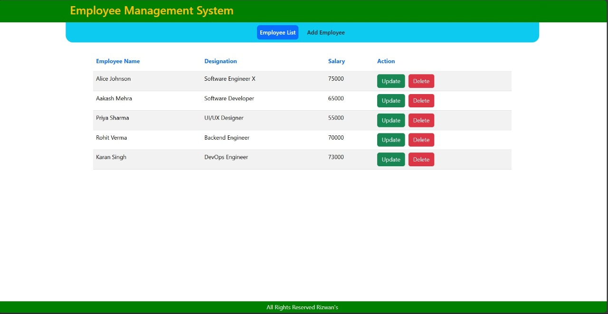

<h1 align="center" style="color:#2c3e50;">👨‍💼 Employee Management System</h1>

<p align="center">
  
</p>

<p align="center">
  <b>Modern frontend for managing employee data via a Spring Boot & MySQL backend.</b><br>
  Built with Angular and Bootstrap, it allows CRUD operations through a clean and responsive UI.
</p>

---

## 📄 About the Project

The **Employee Management System (EMS)** is a full-stack web application designed to manage employee records.  
This repository contains the **frontend** of the project, which interacts with a RESTful API built using Spring Boot and MySQL.

---

## 🌟 Features

- 📋 **List All Employees**  
  View all employee records in a structured table format.

- ➕ **Add New Employee**  
  Submit a form to create a new employee record.

- ✏️ **Update Employee**  
  Edit and update existing employee information.

- ❌ **Delete Employee**  
  Remove an employee from the system.

- 🔍 **Responsive Design**  
  Fully mobile-friendly and optimized layout.

---

## 🛠️ Tech Stack

- 🎯 **Framework:** Angular (v16+ with standalone components)
- 🎨 **Styling:** Bootstrap 5
- 🔗 **Backend:** Spring Boot + MySQL  
  ➡️ [Backend GitHub Repository](https://github.com/your-username/EmployeeManagementSystemApplication-Backend)

---

## 📁 Project Structure

```bash
employee-management-frontend/
├── src/
│   ├── app/
│   │   ├── components/
│   │   ├── services/
│   ├── assets/
│   │   └── Github-Images/
│   │       └── Preview-Image.png
│   └── index.html
├── angular.json
├── package.json
